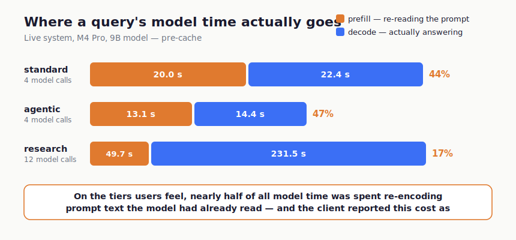
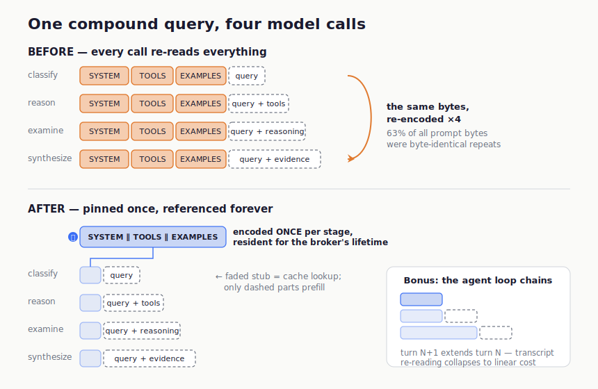
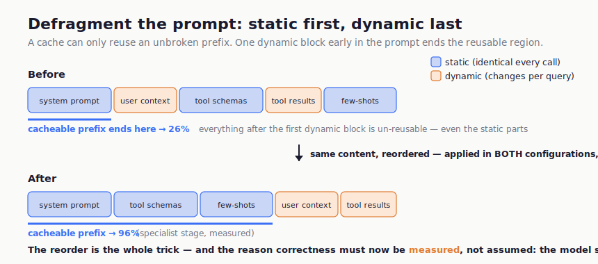

# Your local AI is re-reading its own prompt

*Measuring — and eliminating — the prefill tax in a local AI pipeline. The Kira Project, July 2026. Patent pending (U.S. provisional 64/105,533).*

---

Everyone benchmarks local LLMs the same way: decode tokens per second. Nobody watches the other number. On our system, the other number was **nearly half of all model time** — and it was being spent re-reading text the model had already read, thousands of times a day, invisibly.

Quick definitions, then the story. An LLM answers in two phases: **prefill** reads — the entire prompt is processed token-by-token into the model's working state before the first output token can exist (that's the pause before the answer starts) — and **decode** writes, one token at a time against that state. "Tokens per second" measures decode only. Prefill cost scales with prompt length, and in a multi-stage pipeline the prompt is mostly boilerplate the model has read ten thousand times before. Picture a lawyer who re-reads the entire case file before answering each deposition question.

This is the story of finding that tax, measuring exactly what it cost, and removing it with a discipline we think matters more than the cache itself. Everything below is measured on real hardware, on a production system, with the receipts in a public evidence ledger.

## The setup

Kira is a local compound-AI assistant: one 9-billion-parameter model (8-bit quantized, hybrid attention) serving every pipeline role — router, specialist, synthesizer, agentic planner — on an Apple M4 Pro with 24 GB of unified memory, through Apple's MLX framework. No cloud calls, ever. A query flows through a classifier, a reasoning loop with ~50 live tools, and a synthesizer; each stage is the same model wearing a different prompt.

That "different prompt" detail is where the story hides.

## The regression nobody reopened

Every month of this project's history — five of them, at the time of writing — is recorded in architecture decision records, and one of them contains a finding that quietly inverted. Early on, we benchmarked KV-cache prefix reuse and concluded we had it for free: our then-runtime (Ollama, on llama.cpp) automatically reused the key/value state for any request sharing a token prefix with the previous one. Static stage prompts + pinned models = every call after the first skipped its shared prefix. The same research noted that MLX had no built-in cross-request prefix caching. Both findings were correct that day.

Then we migrated runtimes — Ollama out, in-process MLX in, for independently excellent reasons (93 s vs 180 s per query, no phantom model loads). The migration **silently deleted the automatic prefix reuse**, and nobody reopened the old finding. Worse: the new client reported `prompt_eval_count: 0` on every call. The cost wasn't just unpaid attention — it was *literally invisible to our own instrumentation*.

**Lesson one: when you change runtimes, re-audit every "we get X for free." The free things don't announce their departure.**

## Instrument first

Before building anything, we surfaced the inference engine's own per-call statistics — prompt token counts and prefill durations — into our telemetry. No mechanism, no cache, just eyes. What they saw, on the live broker:

| Pipeline tier | LLM calls | Prompt tokens | Prefill time | Decode time | Prefill share of model time |
|---|---|---|---|---|---|
| standard | 4 | 8,880 | **20.0 s** | 22.4 s | **44%** |
| agentic | 4 | 5,749 | **13.1 s** | 14.4 s | **47%** |
| research | 12 | 21,989 | **49.7 s** | 231.5 s | 17% |

And a critical companion fact: after the migration, end-to-end wall time ≈ model time (46.7 s end-to-end vs 45.7 s of model time on the standard tier). There was no non-model overhead left to optimize. The remaining latency **was** model time — and nearly half of it, on the tiers users feel, was the model re-encoding the same stage system prompts, tool schemas, and few-shot examples on every call of every query.

## Measure the prize before building

Second measurement, still no mechanism: we captured live prompts under an environment-gated flag and computed the **byte-stable prefix share** — the fraction of prompt bytes identical across calls of the same stage. Answer: **63%**. That number bounds the achievable win and told us the build was worth doing *before we wrote it*.

It also exposed a problem. Some stages interleaved dynamic content (tool results, session context) *before* static content, shrinking the stable prefix. Our specialist stage was only 26% cacheable as-written.

## The mechanism (the part that isn't novel)

We wired mlx-lm's `LRUPromptCache` into our client behind a default-off flag:

- **Pinned stage prefixes.** Pipeline stages register their static prefixes with the orchestrator *before any request*; registered prefixes get guaranteed residency for the broker's lifetime. The pipeline owns the knowledge of where static ends — the cache layer doesn't guess.
- **Within-query chaining.** After each call, the full token sequence is inserted, so an agentic loop's turn N+1 — which extends turn N's transcript — gets a shorter-prefix hit. Transcript re-prefill collapses to linear cost.
- **The static-first partition.** Stage prompts were restructured so static content (system prompt ∥ tool schemas ∥ exemplars) precedes all dynamic content. The specialist stage's cacheable share went from **26% to 96%**.

We claim no novelty for prefix caching itself — RadixAttention, vLLM's automatic prefix caching, Marconi (hybrid-attention caching), and KVFlow (workflow-aware caching) own that ground, and if you're building a serving engine you should read them. What we think the field is missing is the next part.

## Measurement-gated activation (the part that is)

Here's the thing about that static-first partition: **it changes the prompts the model sees.** Serving-layer caches can honestly claim "exact reuse doesn't change output" — but the moment you restructure prompts to widen the cacheable prefix, correctness is no longer guaranteed by construction. You have to *measure* it. Most systems don't; they ship the optimization enabled and assume.

We gated activation on a discipline:

1. **The partition is applied unconditionally — in both cache-enabled and cache-disabled configurations.** This is the load-bearing move. Both configurations share identical prompt structure, so the parity evaluation isolates exactly one variable: the cache.
2. **A byte-equivalence parity gate** compares gate outcomes between the two configurations across our assertion battery (1,100+ live assertions — the fixture is our product spec). Result: gate equivalence *exact*.
3. **Only then, an explicit operator flip.** Default-off until a human reviews the measurements.
4. **The cache-enablement flag is composed into the pipeline-version hash** that keys our semantic response cache — responses generated under one enablement state are never served under another. A change of adapter (LoRA) identity flushes prefix-cache state, because KV computed under one set of weights is invalid under another.

Measured after activation, end-to-end: **standard −34%, agentic −45%, research −24%.** And the instrument from step one is still running — the meter that found the problem verifies the fix, unchanged.

One more distinction worth drawing precisely, because the literature blurs it: this is measurement gating **enablement on output parity** — not tuning a parameter of an already-active cache (hit-rate bootstraps do that), and not per-entry admission forecasting (speculative insertion does that). The question our gate answers is prior to both: *should this optimization exist in this system at all?* Our broader runtime applies the same discipline to trained adapters — where, for what it's worth, the gate has refused four candidates and enabled zero. A gate that can only say yes isn't a gate.

## Defensive disclosure: the persistence lifecycle

The natural follow-on — persisting pinned prefixes across restarts — we built as a two-layer split and are deliberately publishing rather than patenting, as prior art:

- **The recipe layer** (a manifest of what to pin: stage identities, prefix boundaries, content hashes) ships with the installer and survives everything.
- **The result layer** (the actual KV bytes) is recomputed on the device at first boot from the recipe, keyed by content hash so staleness self-detects, and purged wholesale on any adapter mutation.

Recipe travels, results are device-local, hashes arbitrate. Anyone shipping local-AI installers will need this shape; consider it disclosed as of this post's date.

## What generalizes

If you run a local multi-stage LLM system, in order:

1. **Surface your engine's prefill stats.** If your client reports zero, that's a bug in your visibility, not a zero cost.
2. **Measure your byte-stable prefix share** on captured live prompts before building anything. It bounds your win.
3. **Partition prompts static-first** — and do it unconditionally, not only in the cached configuration, so you can ever prove parity.
4. **Gate activation on measured output parity**, not on the argument that reuse is exact. The moment you touched prompt structure, it isn't.
5. **Couple cache validity to configuration identity** — flags into your version hash, adapter hashes into your flush triggers. A cache that can serve across config states is a correctness bug waiting for its demo.

The prefill tax is real, it is probably the largest latency line-item in your local pipeline you have never measured, and — measured honestly — it is almost entirely refundable.

---

*Kira is a local-first compound-AI system: one 9B model, ~50 tools, zero cloud inference, built and operated by a single person with AI pair-engineering. The enablement-governance discipline described here is U.S. patent pending (provisional application 64/105,533, filed July 6, 2026). The measurement record — telemetry, parity gates, and the evidence ledger — is maintained in the project's architecture decision records.*
