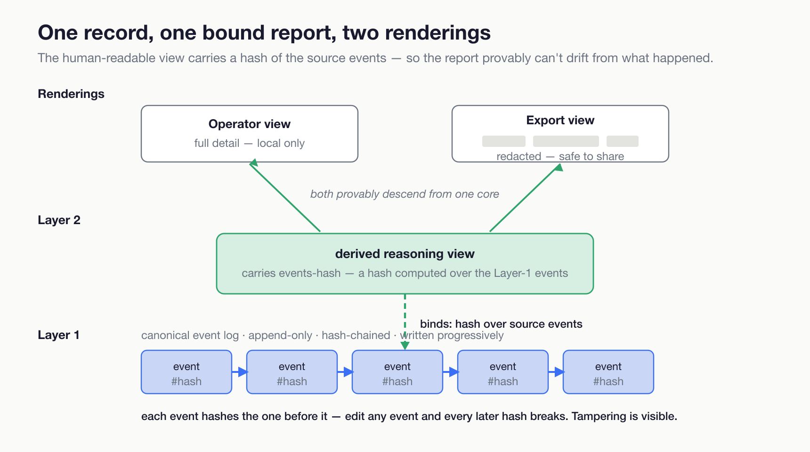

# Your AI's logs can be edited. Its evidence shouldn't be.

*A tamper-evident, two-layer evidence architecture for a local AI pipeline — and why it records what the system couldn't see, not just what it did. The Kira Project, July 2026. Patent pending (U.S. provisional 64/106,848).*

---

Every AI observability tool answers the same question: *what did the model do?* Spans, token counts, tool calls, traces. Useful, and not enough — because all of them share three properties that fail exactly when the answer matters most.

They run on **mutable** stores: a log you can edit after the fact is a log an attacker, an operator, or the model's own error can quietly rewrite. They **collapse three different things into one artifact** — the raw record of what happened, a human-readable report about it, and an implied compliance claim — so a post-hoc summary gets mistaken for the original, and a "we logged it" gets mistaken for "we proved it." And they record **only actions** — they are silent on the negative space: the moment the system couldn't see something, chose not to act, or was nudged by untrusted input into acting wrong.

For a system that acts on your behalf, the negative space is where the important failures live. This is how we built the evidence layer to close all three gaps, on a local pipeline, with the receipts.

## The setup

Kira is a local compound-AI assistant: one 9-billion-parameter model serving every pipeline role — routing, tool-using reasoning, examination, synthesis — on an Apple M4 Pro with 24 GB of unified memory, no cloud calls. A single query touches many stages, each the same model under a different prompt, several of them reaching out to live tools. When it answers you, a lot happened between your question and its response, and the entire point of an evidence layer is to make *all* of it inspectable and *none* of it deniable.

## Two layers, cryptographically bound

The design splits evidence into two layers with a hash binding between them, and the split is the whole idea.

**Layer 1 is a canonical execution log.** As each pipeline stage starts, completes, fails, or times out, an event is appended — stage identity, event type, payload, and two hash fields: a hash of the previous event and a hash of this one. That chaining makes the log tamper-evident: change any past event and every hash after it breaks. Critically, the log is written **progressively**, as the run happens — so if the pipeline crashes before it produces an answer, the evidence of everything up to the crash is already persisted. The most interesting runs to audit are the ones that failed, and those are exactly the ones a write-at-the-end logger loses.

**Layer 2 is a derived reasoning view** — the human-readable account, assembled *after* the run from the canonical events plus telemetry. It carries the stage-by-stage story, an environment attestation, and an evidence-coverage map. And it stores an **events-hash computed from the hashes of the source events it was built from**. That binding is the load-bearing move: the readable summary can never silently drift from the canonical record, because it carries a cryptographic fingerprint of exactly the events it claims to summarize. The report is provably a function of the record, not a story told alongside it.

This directly answers the "collapse" failure. The canonical log is the record. The reasoning view is the report, bound to the record. And the coverage map reports *which evidence fields are present* against governance-aligned categories **without asserting that any legal or regulatory bar is met** — it says "here is what we captured," never "therefore we are compliant." Three concerns, three artifacts, one integrity chain between them.

## Two renderings, one core

The same reasoning view renders two ways. **Operator mode** retains full detail — the query text, response, citations. **Export mode** redacts or omits sensitive fields for anything leaving the machine, while preserving the same trace lineage and the same integrity binding. The raw canonical events never export at all; they're operator-restricted by construction.

So a shareable evidence package is provably derived from the same core as the private one — you can hand someone a redacted record and they can verify it descends, unbroken, from canonical events they're not allowed to see the raw contents of. Redaction without breaking provenance.

## The part most systems skip: recording the negative space

Here is where the architecture stops looking like better logging and starts looking like accountability. Alongside the record of what the system *did*, it records — as first-class, hash-linked canonical events — the things the system *couldn't trust* and *couldn't ground*. Two of those are the ones conventional observability has no place for at all, and they're the ones that matter most:

- **A claim with no supporting source.** A reviewing stage asserted something for which the system held no tool or evidence to back it — a flag, written into the record, that a particular statement may be model assertion rather than grounded fact. Most systems surface the answer and drop the fact that part of it was unsupported.
- **A degraded input, used anyway.** A source that *was* consulted had been failing or returning stale data. The answer may rest on shaky ground, and the record says so, at the moment of use — not the reliability of the tool in general, but its reliability *for this answer*.

These are the empty quadrants. Everyone logs the tool call that succeeded; almost no one seals, as evidence, the fact that a used source was unreliable or that a conclusion had nothing under it. A third negative-space event rounds out the completeness picture — **a capability that existed but wasn't used**, evidence about a run's thoroughness that a conventional log omits because, from its point of view, nothing happened.

The same chain also carries the runtime's security-relevant decisions — navigation and capability-gate events when it acts on live external resources, including the case where untrusted content tries to redirect it (the "confused-deputy" condition), and the cases where it *declined*. None of that is a claim to have invented the *detection* of those conditions — detecting a prompt-injection or gating a capability is well-trodden ground. The point is narrower and, we think, more useful: when any of it happens, it is written into the *same* tamper-evident chain, as evidence, next to everything else — so an audit finds it rather than a silent redirection you'd never know occurred.

Most audit trails record a system's actions. This one also records its unsupported claims, its shaky ground, its blind spots — and, in the same chain, when it was redirected and when it declined — because those are the facts an auditor of an autonomous system actually needs, and they are precisely the facts that "log the tool calls" throws away.

## Why this is the mission, not a feature

There is a version of the AI-safety conversation that ends at "trust the model more." This is the other one. A truthful assistant and a deceptive one both emit the sentence *"I did what you asked."* The only durable difference between them is an evidence layer neither can forge — a record where every claim traces to a hash-chained event, where the shareable summary is provably the same as the private truth, and where the system's own blind spots — the claims it couldn't ground, the inputs it couldn't trust — are written down as plainly as its successes.

That standard should apply to *any* system acting for you, including — especially — the ones built with a great deal of AI assistance, like this one. You should not have to take the builder's word, or the model's word, for what happened inside a run. Built right, you don't: you have the receipts, in a record that breaks visibly if anyone edits it.

## What generalizes

If you're building an agent that acts on someone's behalf and you want its behavior to be provable, not merely logged:

1. **Separate the record from the report, and bind them.** Keep an append-only, hash-chained canonical event log; derive the human-readable view from it; store a hash of the source events inside the view so the summary can't drift from the record.
2. **Write the log progressively.** The runs worth auditing are the ones that failed before the end. A logger that writes at completion loses exactly them.
3. **Redact by rendering, not by deleting.** One canonical core, multiple renderings; the export descends provably from the same events as the private view.
4. **Record the negative space.** Seal, as first-class evidence, the claims that had no supporting source and the inputs that were degraded when used — and, in the same chain, where the system was blind, when it was redirected, and when it declined. Recording that a used source was unreliable, or that a conclusion had nothing under it, is the evidence accountability actually requires, and it's the part conventional observability leaves on the floor.

Performance work makes a local AI usable. This is the other half of the job: making it *answerable*. The first is why you'd run a model on your own machine; the second is why you could ever trust what it did there.

---

*Kira is a local-first compound-AI system: one 9B model, ~50 tools, zero cloud inference, built and operated by a single person with AI pair-engineering. The two-layer evidence architecture described here is U.S. patent pending (provisional application 64/106,848, filed July 7, 2026). Measurements and behavior are from the project's own hardware; the evidence layer, its integrity chains, and the assertion battery that verifies them live in the project's architecture decision records. Written with AI assistance; the author is responsible for all content and conclusions.*
